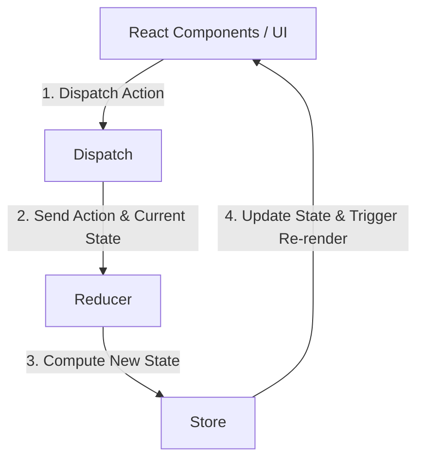

# 1. Redux Fundamentals (Kiến thức cơ bản về Redux)

Chào mừng bạn đến với tài liệu tự học Redux. Tài liệu này sẽ giúp bạn hiểu rõ từ bản chất gốc của Redux (Legacy Redux) cho đến các khái niệm cốt lõi cần phải nắm vững.

---

## 1. Redux là gì? Tại sao cần dùng Redux?

### Redux là gì?
**Redux** là một thư viện quản lý trạng thái (state management) mã nguồn mở dành cho các ứng dụng JavaScript. Mặc dù nó thường được dùng nhiều nhất với **React** hoặc **React Native**, bạn hoàn toàn có thể sử dụng Redux với Angular, Vue, hoặc thậm chí là JavaScript thuần.

### Tại sao cần dùng Redux?
Trong một ứng dụng React/React Native thông thường:
- State được quản lý cục bộ trong từng component (`useState`, `useReducer`).
- Khi cần chia sẻ dữ liệu giữa các component không có quan hệ cha-con trực tiếp, ta phải thực hiện **Prop Drilling** (truyền props qua nhiều tầng trung gian vô ích) hoặc dùng **Context API** (dễ bị re-render không mong muốn nếu cấu trúc phức tạp).

**Redux giải quyết vấn đề này bằng cách:**
1. **Tập trung hóa State (Centralized State):** Đưa toàn bộ trạng thái toàn cục (Global State) của ứng dụng vào một nơi lưu trữ duy nhất gọi là **Store**.
2. **Dễ dự đoán (Predictable):** Quy định các quy tắc nghiêm ngặt để cập nhật State, giúp luồng dữ liệu luôn đi theo một chiều duy nhất (Unidirectional Data Flow).
3. **Dễ Debug:** Nhờ state tập trung và luồng dữ liệu một chiều, ta có thể dễ dàng sử dụng các công cụ như Redux DevTools để "quay ngược thời gian" (Time Travel Debugging) xem state thay đổi qua từng hành động như thế nào.

---

## 2. 3 Nguyên lý cốt lõi của Redux (Three Principles)

Để đảm bảo tính ổn định và dễ dự đoán, Redux dựa trên 3 nguyên lý vàng sau:

### 1. Single Source of Truth (Nguồn sự thật duy nhất)
Toàn bộ trạng thái (state) của ứng dụng sẽ được lưu giữ trong một cây đối tượng (object tree) nằm trong một **Store** duy nhất.
> *Ý nghĩa:* Dễ dàng debug, lưu trữ trạng thái của ứng dụng (persist state) xuống bộ nhớ thiết bị, hoặc đồng bộ hóa dữ liệu.

### 2. State is Read-Only (Trạng thái chỉ đọc)
Cách duy nhất để thay đổi state là phát đi một **Action** (một object mô tả những gì đã xảy ra). Bạn **không bao giờ** được phép chỉnh sửa trực tiếp đối tượng state (ví dụ: không ghi `state.value = 5`).
> *Ý nghĩa:* Đảm bảo không có component nào tự ý thay đổi dữ liệu ngầm mà không thông qua hệ thống kiểm soát của Redux.

### 3. Changes are made with Pure Functions (Thay đổi thông qua hàm thuần túy)
Để xác định cây state thay đổi như thế nào dựa trên actions, bạn viết các hàm gọi là **Reducers**. Reducer phải là một **Pure Function** (Hàm thuần túy):
- Nhận vào `(state, action)` cũ và trả về `state` MỚI hoàn toàn.
- Với cùng một đầu vào, nó luôn trả về cùng một đầu ra.
- Không được chứa các hiệu ứng phụ (Side Effects) như gọi API, thay đổi biến toàn cục, hoặc dùng các hàm ngẫu nhiên như `Math.random()`, `Date.now()`.

---

## 3. Các thành phần chính trong Redux

Để vận hành Redux, chúng ta cần phối hợp 4 thành phần sau:



### A. Action
**Action** là một đối tượng JavaScript thuần (plain object) chứa thông tin gửi từ ứng dụng đến Store. Nó đại diện cho một "sự kiện" xảy ra trong ứng dụng.
- Action bắt buộc phải có thuộc tính `type` (kiểu chuỗi string) để xác định hành động đó là gì.
- Action có thể chứa dữ liệu kèm theo (thường được đặt tên là `payload`).

```javascript
// Ví dụ về một Action thêm công việc cần làm (Todo)
const addTodoAction = {
  type: 'todos/todoAdded',
  payload: 'Học cơ bản về Redux'
};
```

#### Action Creator
Là một hàm trả về một Action object. Giúp code gọn gàng và tránh viết lặp lại object.
```javascript
const addTodo = (text) => {
  return {
    type: 'todos/todoAdded',
    payload: text
  };
};
```

### B. Reducer
**Reducer** là một hàm nhận vào trạng thái hiện tại (`state`) và một đối tượng hành động (`action`), sau đó tính toán và trả về trạng thái mới.

**Công thức:** `(state, action) => newState`

> [!IMPORTANT]
> **Quy tắc quan trọng nhất của Reducer:** Không bao giờ được chỉnh sửa trực tiếp `state` truyền vào. Bạn phải tạo một bản sao (copy) của state cũ, sửa trên bản sao đó và trả về bản sao.

```javascript
const initialState = { value: 0 };

function counterReducer(state = initialState, action) {
  switch (action.type) {
    case 'counter/incremented':
      // Trả về một object hoàn toàn mới (sử dụng spread operator `...`)
      return {
        ...state,
        value: state.value + 1
      };
    case 'counter/decremented':
      return {
        ...state,
        value: state.value - 1
      };
    default:
      // Nếu không khớp với action nào, trả về state cũ không đổi
      return state;
  }
}
```

### C. Store
**Store** là đối tượng liên kết các thành phần trên lại với nhau. Nó giữ trạng thái ứng dụng và cung cấp một vài phương thức quan trọng:
- `getState()`: Cho phép truy cập vào state hiện tại.
- `dispatch(action)`: Cho phép cập nhật state bằng cách gửi đi một action.
- `subscribe(listener)`: Đăng ký các hàm lắng nghe sự thay đổi của state.

```javascript
import { createStore } from 'redux'; // (Lưu ý: hàm này đã bị coi là cũ/deprecated, nhưng hữu ích để hiểu bản chất)

// Khởi tạo store từ Reducer
const store = createStore(counterReducer);

console.log(store.getState()); // { value: 0 }
```

### D. Dispatch
`dispatch` là phương thức của Store. Đây là cách duy nhất để kích hoạt một sự thay đổi trạng thái trong Redux Store.

```javascript
// Gửi action tăng bộ đếm
store.dispatch({ type: 'counter/incremented' });

console.log(store.getState()); // { value: 1 }
```

---

## 4. Tích hợp Redux vào React (React Redux)

Để React component có thể đọc dữ liệu từ Redux Store và dispatch actions, chúng ta sử dụng thư viện kết nối chính thức là `react-redux`.

Thư viện này cung cấp một số thành phần và hooks quan trọng:

### 1. `<Provider>`
Bao bọc component gốc (thường là `App` hoặc `_layout`) của ứng dụng để truyền Store xuống toàn bộ các component con bên dưới.

```jsx
import React from 'react';
import { Provider } from 'react-redux';
import store from './store';
import MainApp from './MainApp';

export default function App() {
  return (
    <Provider store={store}>
      <MainApp />
    </Provider>
  );
}
```

### 2. Hook `useSelector`
Dùng để lấy dữ liệu từ Redux Store về component. Nó sẽ đăng ký lắng nghe store, khi dữ liệu thay đổi, component sẽ tự động re-render.

```jsx
import { useSelector } from 'react-redux';

function CounterDisplay() {
  // Lấy giá trị `value` từ state chung
  const count = useSelector((state) => state.value);
  
  return <Text>Giá trị hiện tại: {count}</Text>;
}
```

### 3. Hook `useDispatch`
Dùng để lấy hàm `dispatch` của store về component, giúp component gửi đi các action.

```jsx
import { useDispatch } from 'react-redux';

function CounterButtons() {
  const dispatch = useDispatch();

  return (
    <View>
      <Button title="Tăng" onPress={() => dispatch({ type: 'counter/incremented' })} />
      <Button title="Giảm" onPress={() => dispatch({ type: 'counter/decremented' })} />
    </View>
  );
}
```

---

## 5. Khi nào nên dùng Redux?

Redux là một công cụ mạnh mẽ nhưng đi kèm với lượng code boilerplate (code mẫu) tương đối nhiều. Bạn nên cân nhắc dùng Redux khi:
- Ứng dụng có lượng state lớn, được chia sẻ ở rất nhiều màn hình khác nhau.
- State được cập nhật liên tục với các logic phức tạp.
- Có nhiều lập trình viên cùng làm việc trên một dự án lớn và cần một bộ quy chuẩn cấu trúc code rõ ràng, chặt chẽ.
- Bạn cần các tính năng debug nâng cao hoặc đồng bộ lưu trữ state (như đăng nhập, giỏ hàng, offline caching).

Nếu ứng dụng của bạn nhỏ, chỉ có vài màn hình đơn giản, hãy cân nhắc sử dụng **Context API** hoặc **Zustand** để giữ cho dự án nhẹ nhàng và phát triển nhanh hơn.

---

> [!TIP]
> Hãy chuyển sang phần tiếp theo: [2. Redux Toolkit & Advanced](file:///home/gmo/Documents/Learning/LearnJS/react-native-state-management/docs/2. redux_toolkit_advanced.md) để tìm hiểu về cách viết Redux hiện đại (Redux Toolkit), giảm thiểu boilerplate, và cách xử lý bất đồng bộ (Thunk/RTK Query) trong thực tế.
